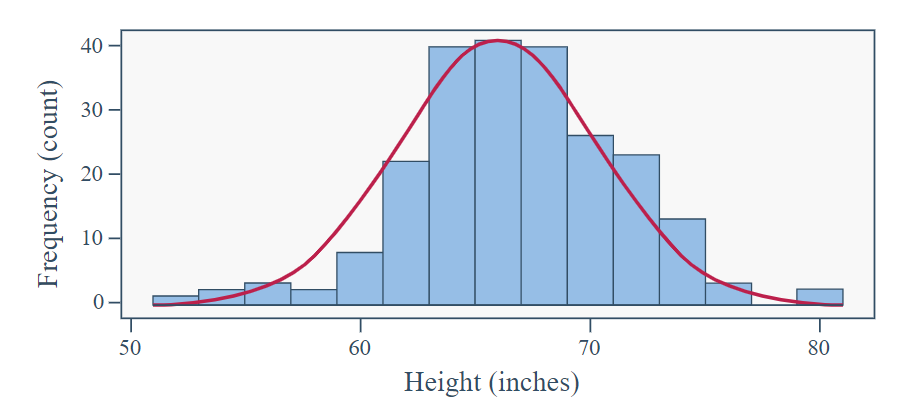
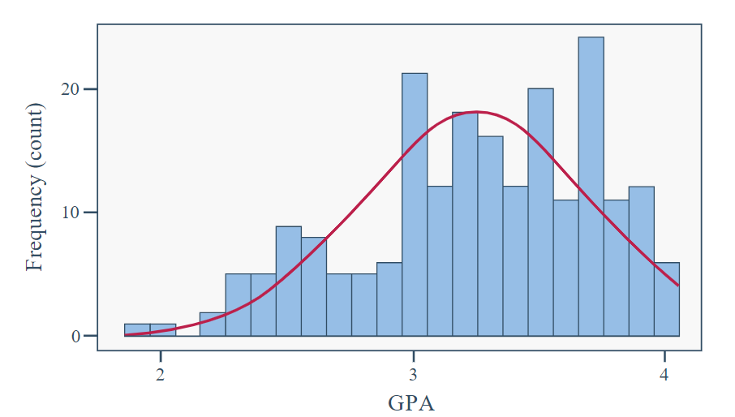
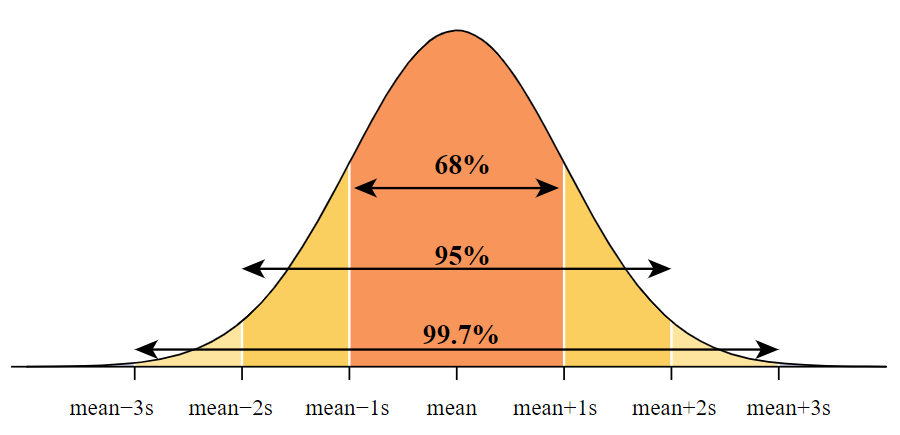

# Statistical Concepts and Reasoning

## Understanding Sample Sizes and Margin of Error in Surveys

Many sample surveys aim to estimate the percentage of people in a population with a certain characteristic or opinion. You might have heard that these polls often use sample sizes of around 1000 to 1500 people. But why is a sample size of around 1000 commonly used? The answer lies in understanding the concept of the margin of error.

## What is the Margin of Error?

You know when you're playing a game and you try to throw a ball into a basket? Sometimes, you don't throw the ball exactly where you want it to go. That's kind of like what the margin of error is in surveys.

- The margin of error:
  - Measures the reliability of estimates based on survey data.
  - Decreases as the sample size increases.
  - Doesn't provide information about bias or other errors in a survey.

For a sample size of 1000, the margin of error for a sample proportion is around 3%. Other inherent survey problems may cause biases of a percent or two, making it often not worth the expense to achieve further improvement in the margin of error by increasing the sample size further.

The margin of error for most sample estimates depends directly on the square root of the sample size. For instance, having four times as many people in the sample would halve the margin of error, making the survey twice as reliable. Notably, the size of the population doesn't affect the margin of error.

## Interpretation of the Margin of Error

- If one obtains many unbiased samples of the same size from a defined population, the difference between the sample percent and the true population percent will be within the margin of error at least 95% of the time.
- It's crucial to understand that the interpretation of the margin of error is based on what would happen if the survey were conducted repeatedly under identical conditions. The margin of error reflects the reliability of the data-gathering process.

When discussing the margin of error, it's essential to recognize that we can't guarantee the difference between the sample percent and the population percent will always be within the margin of error for all possible samples. Hence, statisticians use the laws of probability to ensure that at least 95% of the time, this difference will be within the margin of error.

### Understanding Margin of Error in Surveys: Gallup Emotions Report

The Gallup Global Emotions Report from March 2016 looked at how people in 140 countries felt in 2015. They asked questions to learn about people's emotions.

For example, in Paraguay, they talked to about 1000 adults. They found that 84% of them said they smiled or laughed a lot the day before. Meanwhile, in Syria, they also talked to about 1000 adults, and only about 36% said they smiled or laughed a lot.

Both surveys had a margin of error of about 3%. But what does that mean?

#### Interpretation of Margin of Error

- If we assume the survey was done fairly, then we can say that the difference between the percent we found and the true percent in the whole population is likely to be within 3%, about 95% of the time.
- So, we're pretty confident that between 81% to 87% of adults in Paraguay smile or laugh a lot each day.
- Also, because our range (81% to 87%) is all above 72%, we can say we're quite sure that the rate in Paraguay is higher than the worldwide average of 72%.
- In Syria, even though the population is three times bigger, the margin of error is still about 3%. But remember, the margin of error only tells us about the randomness in the survey. It doesn't say anything about other issues like not being able to talk to everyone because of safety concerns.

## Types of Research Studies

Research studies can be categorized into two basic types: experiments and observational studies.

### Experiments (Randomized Experiments)

- **What are they?** Experiments involve the researcher creating differences in the explanatory variable by assigning treatments randomly.
- **Key Points:**
  - Allow for "cause and effect" conclusions if random assignment is used.
  - Help minimize the impact of confounding variables.
  - Example: Comparing the effectiveness of two teaching methods.

### Observational Studies

- **What are they?** Observational studies involve observing differences in the explanatory variable without any random assignment of treatments.
- **Key Points:**
  - Strive for association conclusions since "cause and effect" conclusions are not possible.
  - May face challenges with confounding variables.
  - Example: Studying the relationship between smoking and wrinkles.

## Understanding Standard Scores

Standardized scores, also known as "standard scores" or "z-scores," help us understand where an observation stands relative to others in a dataset.

### What are Standardized Scores?

- Standardized scores measure relative standing on a list by indicating the number of standard deviations above (+) or below (-) the mean a value is.
- These scores are computed using the formula:

    Standardized Score (Z-score) = (Value - Mean) / Standard Deviation

- The list of standardized scores always has a mean of 0 and a standard deviation of 1.0 because:
  - Subtracting the mean from every value makes the new mean equal zero.
  - Dividing every value by the standard deviation makes the new standard deviation equal to 1.

#### Example: Speedometer

- Suppose the gas mileage for compact SUVs in the 2013 model year has a mean of 22 mpg and a standard deviation of 3 mpg.
- An SUV getting 25 mpg would have a standardized score of +1, indicating it's one standard deviation above the mean.
- Another SUV getting 20.5 mpg would have a standardized score of -0.5, showing it's one-half of a standard deviation below the mean.

#### Example: CO2 Emissions

- Consider 4-cylinder and 6-cylinder cars' CO2 emissions in the 2013 model year.
- A Honda Civic emitting 284 ppm would have a z-score of -1.06, while a Toyota Camry emitting 358 ppm would have a z-score of +0.77.
- Despite the absolute ppm difference, the Honda Civic has higher relative CO2 emissions compared to other cars with the same number of cylinders.

## Understanding the Normal Curve

Many natural measurement variables exhibit a predictable bell-shaped pattern known as the normal distribution. This pattern is characterized by a symmetrical distribution, with most data points clustered around the center and few on the extremes.

### Characteristics of Normal Distribution

- Variables resulting from the sum or average of similar components tend to follow a normal distribution.
- Examples include the weights of cartons of eggs, which result from the sum of individual egg weights, and psychological measures like stress levels derived from questionnaire scores.
- Such measures within a homogeneous group of individuals often approximate a normal curve.

### Examples of Normal Curves

#### Heights (inches)
- The distribution of heights among Stat 100 students resembles a normal curve.
- The mean height is 66.3 inches, and the median is 66 inches, indicating symmetrical distribution.

#### Grade Point Average (GPA)
- The GPA distribution shows slight left skewness but can roughly be approximated as normal.
- The upper tail of the distribution is clustered due to the capped GPA limit of 4.0.
- Despite the skewness, mean and median values are close, allowing for rough approximations using the normal curve.

#### Number of Tattoos
- The distribution of tattoos is highly skewed to the right, with most students having no tattoos.
- The discrete nature of the variable and the lack of a continuous range lead to gaps in the histogram.
- Due to the extreme skewness and discrete nature, the normal curve should not be used to make any approximations for tattoo data.

###  The Empirical Rule
The empirical rule is a guideline that can be applied when you know that the sample is approximately normally distributed. The empirical rule also helps one to understand what the standard deviation represents.

The empirical rule says that for any normal (bell-shaped) curve, approximately:

-  68%of the values (data) fall within 1 standard deviation of the mean in either direction
-  95%of the values (data) fall within 2 standard deviations of the mean in either direction
-  99.7%of the values (data) fall within 3 standard deviations of the mean in either direction

### Example: Empirical Rule

In Example above, we examined the distribution of heights among Stat 100 students, finding it to be normally distributed. Now, we can apply the empirical rule to this dataset. 

#### Dataset Details:
- Mean (µ): 66.3 inches
- Standard Deviation (σ): 4 inches

#### Calculations:

- Mean ± 1(SD) = 66.3 ± 4 inches = (62.3 to 70.3 inches)
- Mean ± 2(SD) = 66.3 ± 2(4) inches = 66.3 ± 8 inches = (58.3 to 74.3 inches)
- Mean ± 3(SD) = 66.3 ± 3(4) inches = 66.3 ± 12 inches = (54.3 to 78.3 inches)

#### Interpretation:

- Approximately 68% of heights fall between 62.3 and 70.3 inches.
- About 95% of heights lie within the range of 58.3 to 74.3 inches.
- Nearly 99.7% of heights are within the range of 54.3 to 78.3 inches.

#### Note:

- Heights smaller than 54.3 inches or taller than 78.3 inches would be very unusual within this sample.
- With 68% of heights within one standard deviation of the mean, the remaining 32% is distributed symmetrically, with 16% falling below 62.3 inches and 16% above 70.3 inches.
- Percentiles in the normal curve are determined by standardized scores, as depicted in Table 8.1 in Chapter 8 of the textbook (page 175). For example, the 23rd percentile corresponds to a standard score of z = -0.74, while the 97th percentile corresponds to z = 1.88.

