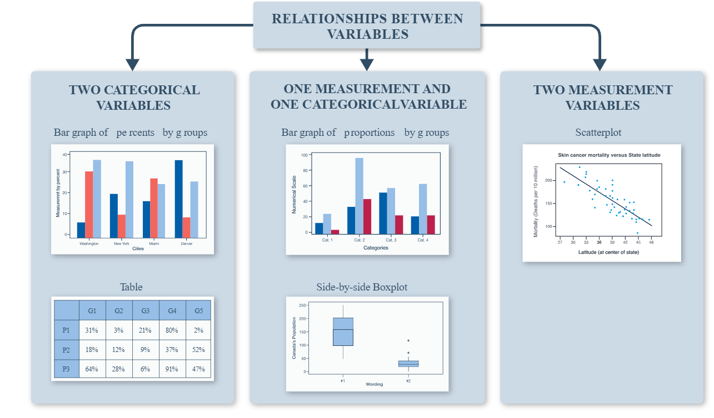
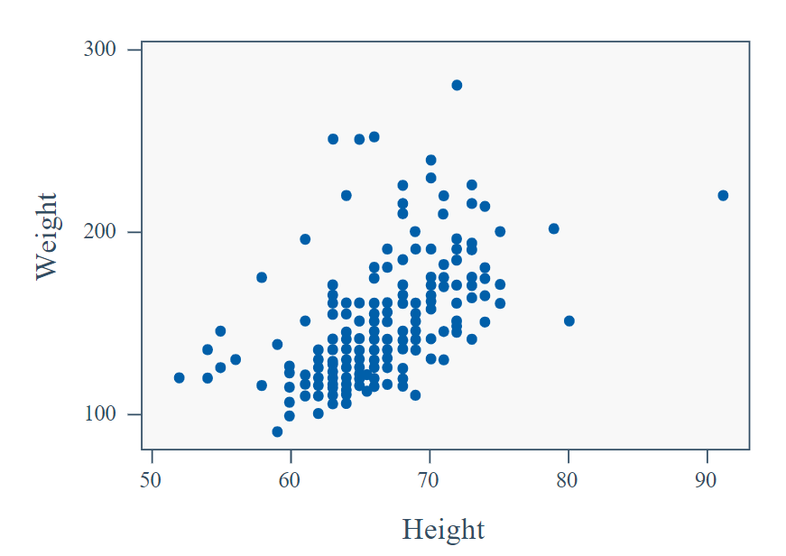

# Relationships Between Measurement Variables

We will examine the relationship between measurement variables; how to picture them in scatterplots and understand what those pictures are telling us. The overall goal is to examine whether or not there is a relationship (association) between the variables plotted. In Lesson 6, we will discuss the relationship between different categorical variables. 

## Graphs for Two Different Measurement Variables

In a previous lesson, we learned about possible graphs to display measurement data. These graphs included: dotplots, stemplots, histograms, and boxplots view the distribution of one or more samples of a single measurement variable and scatterplots to study two at a time 

### Example 5.1 Graph of Two Measurement Variables
The following two questions were asked on a survey of 1203 STAT 100 students:

-  What is your height (inches)?
-  What is your weight (lbs)?

Notice we have two different measurement variables. It would be inappropriate to put these two variables on side-by-side boxplots because they do not have the same units of measurement. Comparing height to weight is like comparing apples to oranges. However, we do want to put both of these variables on one graph so that we can determine if there is an association (relationship) between them. 

In Figure above, we notice that as height increases, weight also tends to increase. These two variables have a positive association because as the values of one measurement variable tend to increase, the values of the other variable also increase. You should note that this holds true regardless of which variable is placed on the horizontal axis and which variable is placed on the vertical axis.