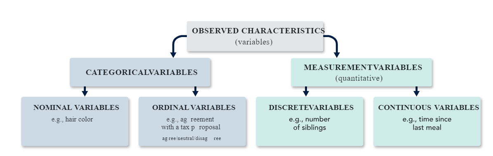

--- 
title: "Inference I"
author: "AbdulHafiz Abba"
date: "`r Sys.Date()`"
site: bookdown::bookdown_site
---


# Introduction to Statistical Data - Sources, Collection, and Preliminary Analysis

We will explore the various sources of data, methods of collection, and preliminary analysis using tables and graphs. Understanding these concepts is fundamental to becoming proficient in statistical analysis.

## Sources of Data

Statistical data can be sourced from various places, including:

1. **Official Records**: Government agencies, such as the National Bureau of Statistics, provide data on demographics, economics, and other fields. These records often include census data, labor statistics, economic indicators, and more, collected through official surveys and administrative records.

2. **Surveys**: Surveys conducted by organizations or researchers collect data directly from respondents. Surveys can be conducted through various means, including online questionnaires, telephone interviews, or in-person interviews. They are often used to gather opinions, preferences, behaviors, and other information from specific populations.

3. **Experiments**: Data from controlled experiments provide valuable insights into cause-and-effect relationships. In experimental studies, researchers manipulate one or more variables and observe the effects on other variables. This type of data collection is common in scientific research, clinical trials, and social experiments.

4. **Observations**: Data can also be collected through direct observation of phenomena. Observational studies involve observing and recording data without interfering with the subjects. This method is commonly used in fields such as anthropology, ecology, and sociology to study natural behavior and phenomena.

5. **Secondary Sources**: Secondary sources involve using data that has already been collected and published by other sources. This can include academic journals, research reports, books, and online databases. Secondary data analysis allows researchers to leverage existing data for new insights or to validate findings from primary research.

6. **Sensor Data and Internet of Things (IoT)**: With the advancement of technology, data generated from sensors and IoT devices have become significant sources of information. These data sources provide real-time or near-real-time data on various aspects of the environment, infrastructure, health, and more.

Each source of data has its advantages and limitations, and researchers must carefully consider the appropriateness and quality of the data for their analysis.

## Defining a Common Language

Data is a collection of a number of pieces of information. Each specific piece of information is called an observation.  The observations are measurements of certain characteristics which we call "variables". The word "variable" is used because the pieces of information, the observations, vary from one person to the next.



### Example Variables


Consider the following variables:

\[
  \begin{array}
    \textbf{Number} & \textbf{Variable} & \textbf{Type of Variable} \\
    \hline
    1 & \text{Which are you? Near-sighted,} & Categorical \\
    &far-sighted, neither\\
    2 & \text{What is your height?} & \text{Measurement and Continuous} \\
    3 & \text{How many phone calls did you make } & \text{Measurement and Discrete} \\
    & \text{yesterday on a cell phone?}\\
    4 & \text{What is your cholesterol level?} & \text{Measurement and Continuous} \\
    \end{array}
  \]

Hopefully, you find the classification of the first three variables easy to understand.

-  Variable \#1 is a categorical variable because the possible choices are "words" or "categories."
-  Variable \#2 is a measurement variable because the possible choices are "numbers." This variable is also called a continuous variable because it can assume a range of values on a continuum. You need an instrument, such as a tape measure or a ruler, to determine height. With measurement variables that are continuous, it is often necessary to use an instrument to determine the value of the variable. Measurement variables that are continuous can be subdivided into fractional parts (subdivided into smaller and smaller units of measurement). Typically, a continuous measurement variable is expressed as "an amount of" something.
-  Variable \#3 is a measurement variable because the possible choices are numbers. It is also a discrete variable because one can simply count the number of phone calls made on a cell phone in any given day. The possible numbers are only integers such as 0, 1, 2, ..., 50, etc. (Some of you probably make a lot of cell phone calls.) Discrete measurement variables cannot be subdivided into smaller and smaller fractional parts (smaller and smaller units of measurement). Often, a discrete measurement variable is expressed as "a number of" something.
-  Variable \#4 is somewhat ambiguous. Obviously what the variable is measuring (cholesterol levels) can be expressed on a continuum of possible values - but subjects are likely to round off or only know their levels as a discrete value. Cholesterol levels must be determined by a blood test where an instrument is used to determine the final value. The reported value represents the concentration of cholesterol in the blood. The appropriate units are milligrams per deciliter (mg/dL). What typically happens is that the value of the cholesterol level is rounded to the nearest whole number. Consequently, the cholesterol level might look like a discrete variable - but the raw values are continuous and, since the amount of "discreteness" is not great, a variable like this would be treated the same way as a continuous variable in any analyses.

-  **Sampling Unit:** The individual person, animal, or object that has the measurement (observation) taken on them/it
-  **Population:** The entire group of individuals or objects that we wish to know something about. A numerical characteristic of the population is called a parameter.
-  **Sampling Frame:** The list of the sampling units from which those to be contacted for inclusion in the sample is obtained. The sampling frame lies between the population and sample. Ideally, the sampling frame should match the population, but rarely does because the population is not usually small enough to list all members of the population.
-  **Sample:** Those individuals or objects who provide the data to be collected. Numerical characteristics of the sample are called statistics and are typically used as estimates of population parameters.


## Types of Data

Data can be classified into two main types: primary data and secondary data.

### Primary Data

Primary data is collected firsthand by the researcher for a specific purpose. It is original and directly obtained from the source.

### Secondary Data

Secondary data is collected by someone else for a purpose other than the researcher's current need. It is already available and can be obtained from sources such as government agencies, research organizations, or published literature.

### Examples

- **Primary Data**: Conducting interviews, surveys, experiments, or observations directly.
- **Secondary Data**: Using existing datasets from government agencies, academic journals, or industry reports.


## Collection Methods

Data collection methods vary depending on the source and nature of the data:

- **Surveys**: Questionnaires or interviews are commonly used to collect data from individuals or groups.
- **Experiments**: Controlled conditions are set up to manipulate variables and observe their effects.
- **Observational Studies**: Researchers observe and record data without interfering with the subjects.


## Descriptive Statistics

Descriptive statistics summarize and describe the main features of a dataset. Common descriptive statistics include:

- **Measures of Central Tendency**: Mean, median, and mode.
- **Measures of Dispersion**: Range, variance, and standard deviation.


###  Measures of Central Tendency

We will focus on measures of central tendency. Measures of central tendency provide a summary of the central or typical value in a dataset. Understanding these measures is crucial for analyzing and interpreting data effectively.

Measures of central tendency, also known as central location measures, are statistical measures that provide a single value to describe the center or typical value of a dataset. The three primary measures of central tendency are:

1.  Mean: The mean, also known as the average, is calculated by summing up all the values in the dataset and dividing by the total number of values. It is sensitive to extreme values, making it less robust in the presence of outliers.

2.  Median: The median is the middle value of a dataset when the values are arranged in ascending or descending order. If the dataset has an odd number of values, the median is the middle value. If the dataset has an even number of values, the median is the average of the two middle values. Unlike the mean, the median is not influenced by extreme values, making it more robust.

3.  Mode: The mode is the value that appears most frequently in a dataset. A dataset can have one mode (unimodal), two modes (bimodal), or more (multimodal). Unlike the mean and median, the mode can be determined for both numerical and categorical data.

### Mean
The mean, denoted by $\bar{x}$ (pronounced as "x bar"), is the arithmetic average of a set of values. It is calculated by summing up all the values in the dataset and dividing by the total number of values.

\[
\bar{x} = \frac{\sum_{i=1}^{n} x_i}{n}
\]

where $x_i$ represents each individual value and $n$ is the total number of values.

#### Example
Consider the following dataset: $X = \{10, 15, 20, 25, 30\}$. To find the mean:

\[\bar{x} = \frac{10 + 15 + 20 + 25 + 30}{5}\]

\[= \frac{100}{5} = 20 \]

So, the mean of the dataset $X$ is $20$.

#### Example

Consider the following dataset representing the exam scores of 10 university students:
\[
\begin{array}
\textbf{Student ID} & \textbf{Exam Score} \\
\hline
1 & 78 \\
2 & 85 \\
3 & 92 \\
4 & 67 \\
5 & 71 \\
6 & 88 \\
7 & 79 \\
8 & 84 \\
9 & 90 \\
10 & 95 \\ 
\end{array}
\]
To compute the mean exam score, we'll follow these steps:

-  Add up all the exam scores.
-  Divide the total by the number of students.

Let's calculate the mean:

\[
\begin{align*}
\text{Total exam scores} &= 78 + 85 + 92 + 67 + 71 + 88 + 79 + 84 + 90 + 95 \\
&= 829
\end{align*}
\]
There are 10 students in total. So, the mean exam score (\(\bar{x}\)) is:

\begin{align*}
\bar{x} &= \frac{829}{10} \\
&= 82.9
\end{align*}

Thus, the mean exam score for these university students is \(82.9\).


### Median
The median is the middle value in a sorted dataset. If the dataset has an odd number of values, the median is the middle value. If the dataset has an even number of values, the median is the average of the two middle values.

#### Example
Consider the dataset: $Y = \{12, 15, 20, 25, 30, 35\}$. The median is $20$, as it is the middle value.

Consider another dataset: $Z = \{10, 15, 20, 25, 30, 35\}$. The median is the average of the two middle values, which is $\frac{20 + 25}{2} = 22.5$.

### Example

Consider the following dataset representing the exam scores of 12 university students:
\[
\begin{array}
\textbf{Student ID} & \textbf{Exam Score} \\
1 & 78 \\
2 & 85 \\
3 & 92 \\
4 & 67 \\
5 & 71 \\
6 & 88 \\
7 & 79 \\
8 & 84 \\
9 & 90 \\
10 & 95 \\
11 & 62 \\
12 & 93 \\
\end{array}
\]
To compute the median exam score, we'll follow these steps:


-  Arrange the exam scores in ascending order.
-  If the number of scores is odd, the median is the middle value. If the number of scores is even, the median is the average of the two middle values.


Let's calculate the median:


-  First, arrange the exam scores in ascending order: \(62, 67, 71, 78, 79, 84, 85, 88, 90, 92, 93, 95\).
-  Since there are 12 scores (an even number), the median is the average of the 6th and 7th scores.


The 6th and 7th scores are \(84\) and \(85\), respectively.

\begin{align*}
\text{Median} &= \frac{84 + 85}{2} \\
&= \frac{169}{2} \\
&= 84.5
\end{align*}

Thus, the median exam score for these university students is \(84.5\).

### Mode
The mode is the value that appears most frequently in a dataset. A dataset can have one mode (unimodal), two modes (bimodal), or more (multimodal).

#### Example
Consider the dataset: $W = \{10, 15, 20, 20, 25, 30, 30\}$. The mode of $W$ is $20$ and $30$, as they both appear twice, making $W$ bimodal.

#### Example 
Consider the following dataset representing the exam scores of 15 university students:
\[
\begin{array}
\textbf{Student ID} & \textbf{Exam Score} \\
1 & 78 \\
2 & 85 \\
3 & 92 \\
4 & 67 \\
5 & 71 \\
6 & 88 \\
7 & 79 \\
8 & 84 \\
9 & 90 \\
10 & 85 \\
11 & 85 \\
12 & 88 \\
13 & 95 \\
14 & 90 \\
15 & 85 \\
\end{array}
\]

To compute the mode exam score, we'll identify the score that appears most frequently.

Let's calculate the mode:

- Count the frequency of each score.
- Identify the score(s) with the highest frequency.


The frequency distribution of exam scores is as follows:
\[
\begin{array}
\textbf{Exam Score} & \textbf{Frequency} \\
78 & 1 \\
85 & 4 \\
92 & 1 \\
67 & 1 \\
71 & 1 \\
88 & 2 \\
79 & 1 \\
84 & 1 \\
90 & 2 \\
95 & 1 \\
\end{array}
\]

The mode is \(85\) since it appears most frequently (4 times).

Thus, the mode exam score for these university students is \(85\).


## Measures of Dispersion - Range, Variance, and Standard Deviation

Measures of dispersion quantify the spread or variability of a dataset. Understanding these measures is essential for assessing the variability of data points around the central tendency. In this lecture, we'll cover the range, variance, and standard deviation, along with their formulas and practical examples.

### Range

The range is the simplest measure of dispersion and represents the difference between the largest and smallest values in a dataset.

#### Formula:
\[
\text{Range} = \text{Maximum Value} - \text{Minimum Value}
\]

#### Example:
Consider the following dataset: \(X = \{10, 15, 20, 25, 30\}\). To find the range:

\[
\text{Range} = 30 - 10 = 20
\]

So, the range of dataset \(X\) is \(20\).

### Variance

Variance measures the average squared deviation of each data point from the mean of the dataset. It provides a measure of the dispersion of data points around the mean.

#### Formula:
\[
\text{Variance} (\sigma^2) = \frac{\sum_{i=1}^{n} (x_i - \bar{x})^2}{n}
\]
Where:
- \(x_i\) represents each individual value,
- \(\bar{x}\) is the mean of the dataset,
- \(n\) is the total number of values.

#### Example:
Consider the dataset: \(Y = \{12, 15, 20, 25, 30\}\). First, find the mean:

\[
\bar{x} = \frac{12 + 15 + 20 + 25 + 30}{5} = \frac{102}{5} = 20.4
\]

Then, calculate the variance:

\[
\text{Variance} (\sigma^2) = \frac{(12-20.4)^2 + (15-20.4)^2 + (20-20.4)^2 + (25-20.4)^2 + (30-20.4)^2}{5}
\]
\[
= \frac{67.56 + 30.36 + 0.16 + 21.16 + 91.36}{5} = \frac{210.6}{5} = 42.12
\]

So, the variance of dataset \(Y\) is \(42.12\).

#### Example

Consider the following dataset representing the exam scores of 20 university students:

\[
\begin{array}
\textbf{Student ID} & \textbf{Exam Score} \\
2          & 85         \\
3          & 92         \\
4          & 67         \\
5          & 71         \\
6          & 88         \\
7          & 79         \\
8          & 84         \\
9          & 90         \\
10         & 95         \\
11         & 62         \\
12         & 93         \\
13         & 75         \\
14         & 82         \\
15         & 87         \\
16         & 89         \\
17         & 83         \\
18         & 77         \\
19         & 80         \\
20         & 91         \\
\end{array}
\]
To compute the variance of the exam scores, we'll follow these steps:

1. Calculate the mean of the exam scores.
2. Compute the squared difference between each exam score and the mean.
3. Find the average of the squared differences.

Let's calculate the variance:

1. Calculate the mean:
   \[
   \text{Mean} = \frac{\sum \text{Exam Scores}}{\text{Number of Students}}
   \]
   \[
   \text{Mean} = \frac{1689}{20} = 84.45
   \]

2. Compute the squared differences between each exam score and the mean:

\[
\begin{array}
  \textbf{Exam Score} & \textbf{Squared Difference} \\
78         & (78 - 84.45)^2 = 41.60 \\
85         & (85 - 84.45)^2 = 0.20 \\
...        & ... \\
91         & (91 - 84.45)^2 = 42.89 \\
\end{array}
\]

3. Find the average of the squared differences:
   \[
   \text{Variance} = \frac{\sum \text{Squared Differences}}{\text{Number of Students}}
   \]
   \[
   \text{Variance} = \frac{862.55}{20} = 43.13
   \]

So, the variance of the exam scores for these university students is \(43.13\).

```{r echo=FALSE, message=FALSE, warning=FALSE}
# Exam scores data
exam_scores <- c(78, 85, 92, 67, 71, 88, 79, 84, 90, 95, 62, 93, 75, 82, 87, 89, 83, 77, 80, 91)

# Calculate the variance
variance <- var(exam_scores)

# Plotting scatter plot
plot(1:length(exam_scores), exam_scores, 
     main = "Scatter Plot of Exam Scores",
     xlab = "Student ID",
     ylab = "Exam Scores",
     col = "blue",
     pch = 19)

# Add a horizontal line representing the mean
abline(h = mean(exam_scores), col = "red", lwd = 2)

# Add text for variance
text(x = 5, y = max(exam_scores) - 5, labels = paste("Variance:", round(variance, 2)), col = "blue")

```
### Standard Deviation

The standard deviation is the square root of the variance. It provides a measure of the dispersion of data points around the mean, in the same units as the original data.

#### Formula:
\[
\text{Standard Deviation} (\sigma) = \sqrt{\text{Variance}}
\]

#### Example:

To calculate the standard deviation of exam scores, we first need to compute the variance as shown in the previous example. Once we have the variance, we can take the square root of it to obtain the standard deviation.

Using the same dataset of exam scores:

- Mean of exam scores: $\bar{x} = 84.45$
- Variance of exam scores: $s^2 = 43.13$

The formula to calculate the standard deviation ($s$) is:

$$
s = \sqrt{s^2}
$$

Substituting the variance value into the formula:

$$
s = \sqrt{43.13} \approx 6.57
$$

Thus, the standard deviation of the exam scores for these university students is approximately $6.57$.


## Exploring Graphs in Statistical Analysis

Graphs are powerful tools for visualizing data and understanding relationships between variables. We will discuss when to use each type of graph, how best to use them, and the appropriate kind of data for each graph.

### 1. Histograms

- **When to use:** Histograms are used to visualize the distribution of a single continuous variable.
- **How to use:** Plot the frequency distribution of data using bars. Adjust the number of bins to balance detail and smoothness.
- **Appropriate data:** Continuous numerical data, such as exam scores, heights, or weights.

### 2. Bar Charts

- **When to use:** Bar charts are used to compare the frequency or proportion of different categories.
- **How to use:** Plot bars for each category with the height representing the frequency or proportion. Ensure clear labeling and spacing between bars.
- **Appropriate data:** Categorical or ordinal data, such as survey responses, product categories, or rating scales.

### 3. Boxplot (Box-and-Whisker Plot)

- **When to use**: Boxplots are useful for displaying the distribution and identifying outliers in continuous data. They provide a visual summary of the central tendency, variability, and skewness of the data.
- **How to use**: Interpret the central line (median), box (interquartile range), and whiskers (range of data). Identify outliers using individual points.
- **Appropriate data**: Continuous data with a large number of observations, especially when comparing multiple groups.


### 4. Scatterplots

- **When to use:** Scatterplots are used to visualize the relationship between two continuous variables.
- **How to use:** Plot points representing individual data points with one variable on each axis. Look for patterns, trends, or correlations.
- **Appropriate data:** Paired numerical data, such as height vs. weight, temperature vs. sales.

### 5. Line Graphs

- **When to use:** Line graphs are used to display trends or changes over time.
- **How to use:** Plot data points connected by lines to show the trend. Use clear labeling and ensure a consistent time interval on the x-axis.
- **Appropriate data:** Time series data, such as stock prices, temperature over months, or sales over years.

### 6. Pie Chart

- **When to use**: Pie charts are used to display the composition of a whole and show the relative sizes of different parts.
- **How to use**: Divide the circle into slices representing different categories. The size of each slice corresponds to the proportion or percentage of the whole.
- **Appropriate data**: Categorical data with a small number of categories, where the focus is on proportions or percentages.


